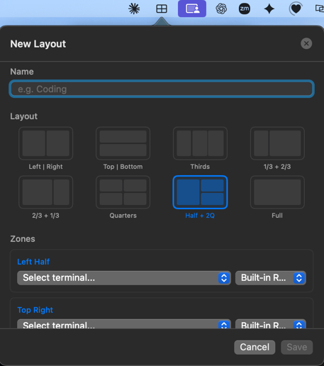

---

**Pane** is a macOS menu bar app that arranges your app windows into saved layouts.

Click a layout — Pane launches the apps, positions their windows into a grid, runs your terminal commands, and gets out of the way. Works with any app: IntelliJ, VS Code, Cursor, Slack, Notion, iTerm, Safari. Not just terminals.



---

### Install

You'll need Xcode Command Line Tools. If you don't have them, run `xcode-select --install` first.

```bash
git clone https://github.com/sayantan94/pane.git
cd pane
make install
open /Applications/Pane.app
```

Or grab `Pane.dmg` from [Releases](https://github.com/sayantan94/pane/releases/latest), open it, drag Pane to Applications.

On first launch, macOS may say it can't verify the app. Right-click Pane.app and choose Open.

### What it does

- **Grid layouts** — halves, thirds, quarters, or a custom drag-to-resize canvas that snaps to halves / thirds / quarters.
- **Capture current windows** — arrange once by hand, hit *Capture Current Windows*, name it. Pane saves the exact positions as a layout.
- **Any app, any window** — terminals get fresh sessions with your `cd` + commands. Everything else (IntelliJ, VS Code, Electron apps, etc.) is positioned via the Accessibility API.
- **Multi-monitor aware** — pick a display at run-time from a visual picker that mirrors your actual screen arrangement.
- **Auto-apply by display setup** — tag a layout as auto-apply and it runs automatically when the same display arrangement returns (e.g. docking back to your external monitor).
- **Per-zone terminal commands** — add lines like `bun dev` or `tail -f log.out` and they run after the `cd`.
- **Menu bar status** — the status icon reflects execution state (running, success, error) so you know what's happening at a glance.

### Permissions

Pane needs two macOS permissions on first use:

- **Automation** — for iTerm and Terminal (creating new sessions, setting bounds). Granted the first time Pane sends AppleEvents — macOS will prompt.
- **Accessibility** — for everything else (IntelliJ, VS Code, Cursor, Slack, etc.). Granted in *System Settings → Privacy & Security → Accessibility*. Pane shows a guided panel that polls for the permission and auto-continues the moment you grant it.

If you rebuild from source, the app's code signature changes, which can invalidate prior grants. Pane's primer includes a *Restart Pane* button for the cases where macOS caches the old answer.

### Where your data lives

- Layouts: `~/.config/pane/layouts/`
- Known apps: `~/.config/pane/custom-apps.json`
- Debug log: `~/.config/pane/debug.log`

### License

MIT
