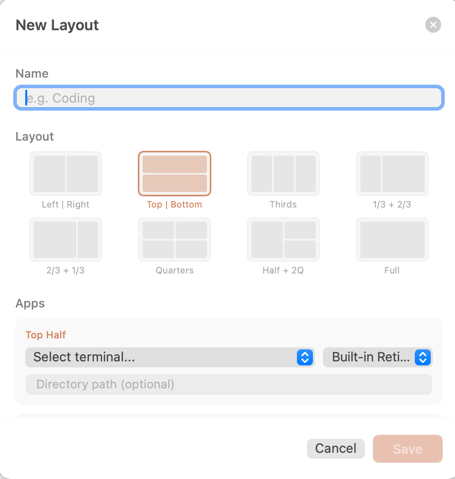

---

**Pane** is a macOS menu bar app that launches and arranges terminal windows in configurable layouts.

Pick a grid template, assign terminals to zones with optional directory paths, and trigger it — Pane opens new windows and tiles them into position. Works across multiple monitors.



---

### Build & Run

```bash
swift build -c release
mkdir -p Pane.app/Contents/MacOS
cp .build/release/Pane Pane.app/Contents/MacOS/Pane
open Pane.app
```

Requires macOS 13+. Automation permission for terminal apps is prompted on first use.

Layouts are stored as JSON in `~/.config/pane/layouts/`.

### License

MIT
